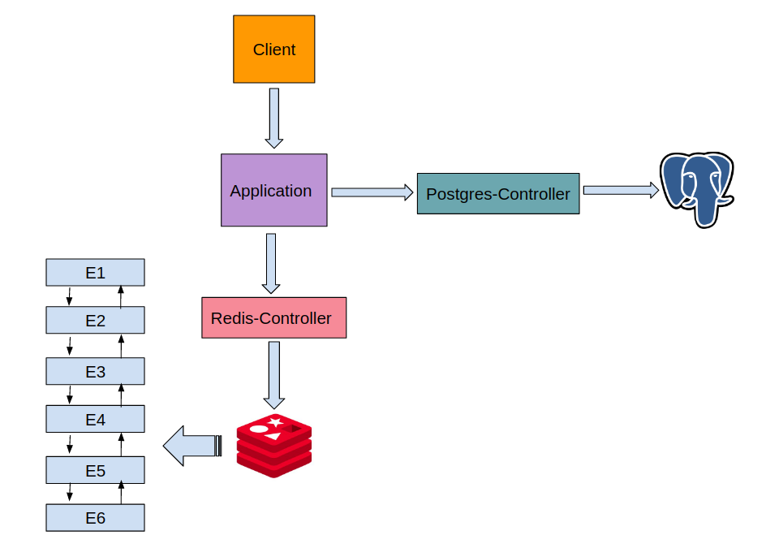

# Caching-Pattern-using-Redis
Memory cache system design using Redis, Postgres, and deployed using docker-compose

# System Overview
When the client asks for data retrieval, the application module searches the data in redis database first (very fast, depends on RAM), if the data is found the application will retrieve it to the client, if it’s not, it will get it from postgres database, insert it to redis, and returns it back to the client.

  
   

## Dataset
The data which will be exchanged is just an emoji name and url in github, based on the following api which returns JSON data format. https://api.github.com/emojis

## Data Format
Internal apis Response Data Format (JSON):
{‘emoji’: emoji_name , ‘url’: url}
{‘emoji’: emoji_name , ‘url’: None}

## Redis Database
It is a linked list containing elements (emoji_name[Key] ,emoji_url[Value]) as nodes, the database has predefined size (max number of elements) as its space is limited. It works in two different modes:

1) Inserting new data to redis
the new element will be inserted in the top of the list (head) representing the highest priority in clients search, when the linked list reaches its maximum size, the last element will be deleted (tail).

2) Data retrieval from redis (If Found)
If the query finds matched data in the db, this data node will be detached and placed at the head of the list representing the highest priority in clients search, so the list is always arranged according to the frequent search queries

If the data is not found, the database will return emoji name and None value for the url

## Postgres Database
simply it consists of only one table with two columns (emoji_name , emoji_url) and it works with only one mode, data retrieval from postgres: it will return JSON with emoji_name and url (None if not found)

## Starting the Application
1) Path:/Docker/, run the commands
$sudo docker-compose build
$sudo docker-compose up

2) Path:/Controllers/Postgres/models, open new terminal, run the commands
$python Psql_Database_Setup.py
$python Psql_Database_Load.py
to load the data to postgres database (unfortunately you need to have python and the dependent libraries in your local machine to load the data to db )

3) Restart docker-compose
    a) Stop the postgres container (CTRL+C)
    b) Path:/Docker/, run the command
       $sudo docker-compose up

5) navigate to the url: http://http://localhost:8080/

## References
this system is based on the proposed system designs in this repo https://github.com/donnemartin/system-design-primer.git 